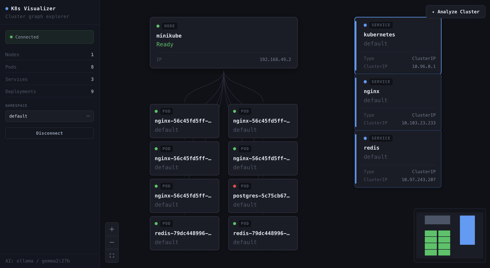
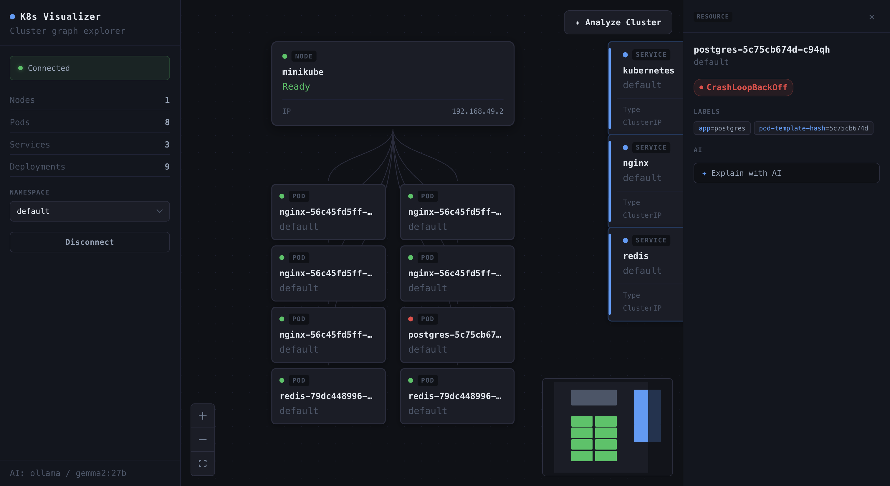

# K8s Visualizer

A real-time Kubernetes cluster visualizer. Upload a kubeconfig and get a live,
graph-based view of your cluster — nodes, the pods scheduled on them, and
services — that updates itself as the cluster changes. An optional AI layer can
explain individual resources or analyze the whole cluster in plain language.

It runs entirely on your machine: a small Fastify backend talks to the
Kubernetes API and streams changes to a React frontend over a WebSocket. Nothing
is deployed into your cluster.

## Screenshots

**Live cluster graph** — nodes, their scheduled pods, and services, updating in
real time with health-based colour coding.



**Resource details + AI** — click any resource to inspect its status, labels, and
kind-specific details, or ask the AI to explain it.



## Features

- **Live graph** of the cluster built with [React Flow](https://reactflow.dev/):
  Kubernetes nodes with their scheduled pods drawn underneath and linked by
  edges, plus services laid out alongside. Pan, zoom, minimap and fit-to-view
  controls included.
- **Real-time updates** over a WebSocket — pods/services/nodes appear, update,
  and disappear as they change in the cluster, with automatic reconnection.
- **Status colour coding** (green / yellow / red / grey) derived from each
  resource's health, e.g. `Running`/`Ready` vs. `CrashLoopBackOff`.
- **Resource details panel** — click any node to inspect its status, labels,
  and kind-specific details (pod containers & placement, node capacity, service
  type & ClusterIP).
- **Namespace switching** — scope the view to a namespace or show all.
- **AI insights** (optional):
  - _Explain with AI_ — a plain-language explanation of a selected resource.
  - _Analyze Cluster_ — a high-level analysis of the current cluster snapshot.
  - Pluggable providers: local [Ollama](https://ollama.com/) (default) or OpenAI.
- **Connect / disconnect** at runtime by drag-and-dropping a kubeconfig file —
  no config baked into the app.


## Getting started

### Prerequisites

- **Node.js** 20+ and npm
- A **Kubernetes cluster** to connect to (local is fine — e.g.
  [minikube](https://minikube.sigs.k8s.io/) or [kind](https://kind.sigs.k8s.io/))
  and a valid **kubeconfig** file
- _(Optional, for AI features)_ [Ollama](https://ollama.com/) running locally
  with a model pulled (e.g. `ollama pull llama3.2`), **or** an OpenAI API key

### 1. Start the backend

```bash
cd server
npm install

# Edit .env to configure the AI provider (optional — see "Configuration" below).
# The server loads it via --env-file, so the file must exist.

npm run dev            # builds, watches, and serves on http://localhost:3001
```

### 2. Start the frontend

```bash
cd client
npm install
npm run dev            # Vite dev server on http://localhost:5173
```

### 3. Connect a cluster

Open **http://localhost:5173**, then drag a kubeconfig file onto the sidebar (or
click to browse) and press **Connect**. The graph populates and starts updating
in real time.

> The frontend talks to the backend at `http://localhost:3001`. If you change
> the backend port, update the URLs in `client/src/shared/config.ts` and the CORS
> origins in `server/src/app.ts`.

## Configuration

### AI provider (backend `.env`)

AI features are driven entirely by environment variables read by the server.
Defaults use a local Ollama instance.

| Variable | Default | Description |
| --- | --- | --- |
| `AI_PROVIDER` | `ollama` | `ollama` or `openai`. |
| `AI_MODEL` | `llama3.2` (ollama) / `gpt-4o-mini` (openai) | Model name. |
| `OLLAMA_URL` | `http://localhost:11434` | Ollama server URL. |
| `OPENAI_API_KEY` | — | Required when `AI_PROVIDER=openai`. |

Example `.env` for local Ollama:

```env
AI_PROVIDER=ollama
OLLAMA_URL=http://localhost:11434
AI_MODEL=llama3.2
```

Example `.env` for OpenAI:

```env
AI_PROVIDER=openai
OPENAI_API_KEY=sk-...
AI_MODEL=gpt-4o-mini
```

The active provider/model is shown in the bottom-left of the sidebar (e.g.
`AI: ollama / gemma2:27b`).

## API reference

The backend exposes a REST API under `/api` plus a WebSocket at `/ws`.

### Cluster

| Method | Route | Description |
| --- | --- | --- |
| `POST` | `/api/cluster/connect` | Connect using an uploaded kubeconfig (multipart `file`). |
| `DELETE` | `/api/cluster/disconnect` | Disconnect from the current cluster. |
| `GET` | `/api/cluster/namespaces` | List namespaces. |
| `POST` | `/api/cluster/namespace` | Switch the watched namespace (`{ "namespace": "..." }`). |
| `GET` | `/api/cluster/status` | Connection status + cluster info. |
| `GET` | `/api/cluster/snapshot` | Full current snapshot of watched resources. |

### AI

| Method | Route | Description |
| --- | --- | --- |
| `POST` | `/api/ai/explain` | Explain a single resource (`{ "resource": {...} }`). |
| `POST` | `/api/ai/analyze` | Analyze the current cluster snapshot. |
| `GET` | `/api/ai/status` | Active AI provider and model. |

### WebSocket (`/ws`)

On connect the server sends a `connection.status` message and, if connected, a
`snapshot`. It then streams `resource.added` / `resource.modified` /
`resource.deleted` events as the cluster changes. The client replies with
periodic `ping` frames (answered with `pong`) to keep the connection alive.

## Project structure

```
.
├── client/                 # React + MobX single-page app (Vite)
│   ├── src/
│   │   ├── app/            # composition root, providers, mediator
│   │   ├── pages/          # top-level screens
│   │   ├── widgets/        # cluster graph, sidebar, resource details
│   │   ├── features/       # connect, namespace, explain, analyze
│   │   ├── entities/       # cluster & ai domain models + stores + APIs
│   │   └── shared/         # HTTP client, WebSocket, UI/DI helpers
│   └── ARCHITECTURE.md     # detailed frontend architecture
└── server/                 # Fastify backend
    └── src/
        ├── cluster/        # Kubernetes service, watches, normalizer
        ├── gateway/        # WebSocket gateway
        └── ai/             # AI service + Ollama/OpenAI providers
```

## Tech stack

- **Frontend:** React 19, MobX, React Flow, Tailwind CSS v4, Vite, TypeScript
- **Backend:** Node.js, Fastify 5, `@kubernetes/client-node`, TypeScript
- **Transport:** REST + WebSocket
- **AI:** Ollama (local) or OpenAI

## Security notes

- The app is **read-only** with respect to your cluster — it only lists and
  watches resources.
- The uploaded kubeconfig is used by the backend to authenticate to the
  Kubernetes API; access is ultimately governed by that kubeconfig's
  permissions. Run it locally and treat your kubeconfig as a secret.
